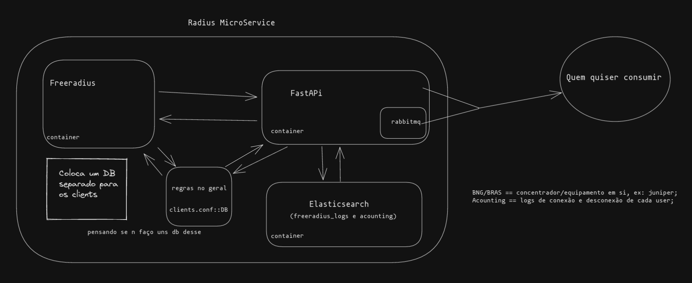

# Freeradius-Microservice
A fast and lightweight Freeradius microservice

## Terms
* BNG/BRAS == concentrador/equipamento em si, ex: juniper;

* Acounting == logs de conexão e desconexão de cada user;

## Diagram
My plan is to build a structure something like this:

